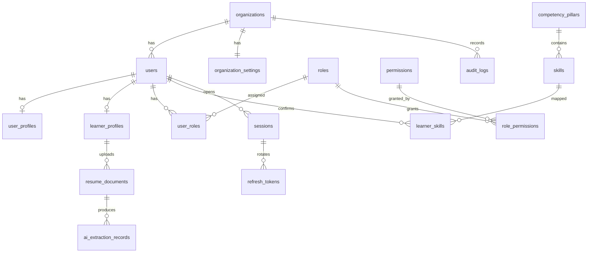

# Database ERD (Phase 1)

```mermaid
erDiagram
  organizations ||--o{ users : has
  organizations ||--|| organization_settings : has
  users ||--o| user_profiles : has
  users ||--o| learner_profiles : has
  users ||--o{ user_roles : has
  roles ||--o{ user_roles : assigned
  roles ||--o{ role_permissions : grants
  permissions ||--o{ role_permissions : granted_by
  learner_profiles ||--o{ resume_documents : uploads
  resume_documents ||--o{ ai_extraction_records : produces
  users ||--o{ learner_skills : confirms
  skills ||--o{ learner_skills : mapped
  competency_pillars ||--o{ skills : contains
  users ||--o{ sessions : opens
  sessions ||--o{ refresh_tokens : rotates
  organizations ||--o{ audit_logs : records
```
