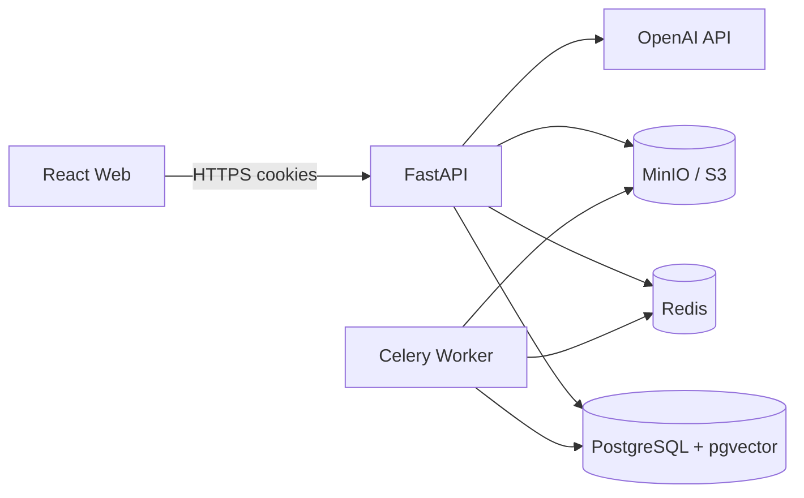
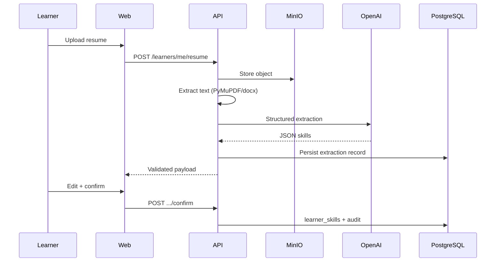

# Architecture Overview

## Layering

- **API routes** — thin HTTP adapters under `app/api/v1/routes`
- **Services** — business logic (`app/services`)
- **Repositories** — persistence (`app/repositories`)
- **AI gateway** — provider-independent interface (`app/ai`)
- **Domain** — permissions and taxonomy constants (`app/domain`)

## Multi-tenancy

Every enterprise-owned row includes `organization_id`. Services and repositories filter by the authenticated user's organization. Cross-tenant access is denied unless the actor is a platform super admin for specific operations.

## Auth

- Argon2 password hashing
- Short-lived JWT access tokens in HttpOnly cookies
- Rotating refresh tokens (hashed at rest)
- CSRF token for cookie-authenticated mutating requests
- Failed-login tracking and temporary lockout

## Phase 1 data flow (resume → skills)

